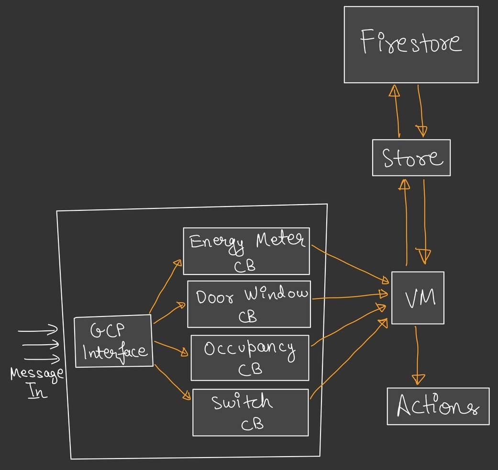

# Virtual Machine
This virutal machine is intented to execute rules for the Podnet. 
The customer creates rules for the devices to behave in a certain 
way on the frontend. That rule is taken by the rule VM and executed
to execute whatever action has to be executed.

## Higher level objective
The goal of this system is:
  - Support instructions/commands that make rules express and check powerful things
  - Map instructions as close to real world sentences, making it easier to model


## Run tests
```
$ pytest
```

## Diagram
This image shows the overall system and what it does.


## How?

### How does rule gets parsed?
  - User selects the desired condition on the React frontend
  - We generate a JSON representation of the conditions
  - The JSON representation is then saved to firestore
  - The Rule VM picks up the JSON representation of the rule when loading everything.
  - JSON data is parsed to create pythonic objects (Rule and Instruction object)
  - VM then goes ahead and executes the rules that have to be executed.


## Instruction Set and JSON representation

### List of instructions
```
AND
OR
AT_TIME
AT_TIME_WITH_OCCURENCE
ENERGY_METER
DW_STATE
DW_STATE_FOR
OCCUPANCY_STATE
OCCUPANCY_STATE_FOR
TEMPERATURE
TEMPERATURE_FOR
RELAY_STATE
RELAY_STATE_FOR
```

### Logical Operation
#### Logical AND
```json
{
  "operation": "logical_and"
}
```

```
AND
```

#### Logical OR
```json
{
  "operation": "logical_or"
}
```

```
OR
```

### Time

Is it past 6PM? Is it before 4PM?
```json
{
    "operation": "at_time",
    "time": "<time in RFC3339 format>"
}
```

```
AT_TIME <time in RFC3339 format> 

AT_TIME 18:00:00+05:30
```


Example:
```json
{
    "operation": "at_time",
    "time": "18:00:00+05:30"
}
```

Turn off the balcony lights at 6PM everyday for 10 times.
```json
{
  "operation": "at_time_with_occurrence",
  "time": "<time in RFC3339 format>",
  "occurrence": 10
}
```

This will become true only when we are past the given time and for the given number of occurences.
```
AT_TIME_WITH_OCCURRENCE <time in RFC3339 format> <no. of times, occurrence>

AT_TIME_WITH_OCCURRENCE 18:00:00+05:30 10
```

### Energy Meter
Generic condition: `<Energy Meter, Device ID, Variable, Comparison OP, Value>`

JSON representation
```json
{
    "type":"energy_meter",
    "device_id": "meter-1",
    "variable": "voltage",
    "comparison_op": "=",
    "value": 21
}
```

```
ENERGY_METER <device_id> <variable> <comparison_op> <value>

ENERGY_METER <device_id> voltage <comparison_op> <value>
ENERGY_METER <device_id> current <comparison_op> <value>
ENERGY_METER <device_id> real_power <comparison_op> <value>
ENERGY_METER <device_id> apparent_power <comparison_op> <value>
ENERGY_METER <device_id> power_factor <comparison_op> <value: [0.0 to 1.0]>
ENERGY_METER <device_id> frequency <comparison_op> <value>

ENERGY_METER meter-1 power > 120
```
If energy meter meter-1 power is more than 120, return true.


### Door Window

Generic condition: `<Door Window, Device ID, State, For how long(min)>`

Is dw1 open?
```json
{
    "operation": "dw_state",
    "device_id": "dw-1",
    "state": "open"
}
```

Checks if the door window state is of the given state

```
DW_STATE <device_id> <state: [OPEN | CLOSE]>

DW_STATE dw-1 OPEN
```

Checks if the door window state is open/close for given amount of time.


Is dw1 open for more than 10 minutes? 
```json
{
    "operation": "dw_state_for",
    "device_id": "dw-1",
    "state": "open",
    "for": 20
}
```

```
DW_STATE_FOR <device_id> <state: [OPEN | CLOSE]> <time in minutes>

DW_STATE_FOR dw-1 OPEN 20
```
This is will check whether dw-1 has been open for more than or equal to 20 minutes.


### Occupancy Sensor
Generic condition: `<Occupancy, Device ID, State, For how long(min)>`

JSON representation:
```json
{
    "operation": "check_occupancy_for",
    "device_id": "occupancy-1",
    "state": "occupied",
    "for": 5
}
```

```
OCCUPANCY_STATE <device_id> <state: [OCCUPIED | UNOCCUPIED]>

OCCUPANCY_STATE os-1 OCCUPIED
```

Is the room occupied?
```json
{
    "operation": "check_occupancy",
    "device_id": "occupancy-1",
    "state": "occupied"
}
```

```
OCCUPANCY_STATE_FOR <device_id> <state: [OCCUPIED | UNOCCUPIED] <time in miunutes>

OCCUPANCY_STATE_FOR os-1 OCCUPIED 20
```
Checks if the room has been occupied for more than or equal to 20 minutes.


### Temperature Sensor
Generic condition: `<Temperature, Device ID, Comparison OP, Value>`


If temperature is more than 31 degree Celsius.
```json 
{
    "operation": "check_temperature",
    "device_id": "podnet-switch-1",
    "comparison_op": "more than",
    "value": 31
}
```

```
TEMPERATURE <device_id> <comparison_op> <value>

TEMPERATURE ps-1 > 30
```
If the temperature of the given device is more than, less than, equal to the given temperature, return true.


If the temperature is 30 degree for more than 15 minutes, turn on the heater.
```json
{
    "operation": "check_temperature_for",
    "device_id": "podnet-switch-1",
    "comparison_op": "equal",
    "value": 30,
    "for": 15
}
```

```
TEMPERATURE_FOR <device_id> <comparison_op> <value> <time in minutes>

TEMPERATURE_FOR ps-1 > 30 15
```
If the temperature of ps-1 is more than 30 for more than or equal to 15 minutes.


### Relay State
Generic condition: `<Relay, Device ID, Appliance, State, For how long(min)>`

Is relay0 of podnet-switch-1, on? Is relay3 of podnet-switch-6, off?
```json
{
    "operation": "is_relay_state",
    "device_id": "podnet-switch-1",
    "relay_index": 0,
    "state": 1
}
```

```
RELAY_STATE <device_id> <relay_index> <state:[on | off]

RELAY_STATE ps-1 0 on
```
Checks if relay index 0 of ps-1 is switched on.


If relay0 of podnet-switch-1 on for more than/less than 10 minutes?
```json
{
    "operation": "is_relay_state_for",
    "device_id": "podnet-switch-1",
    "relay_index": 0,
    "state": 1,
    "for": 10
}
```

```
RELAY_STATE_FOR <device_id> <relay_index> <state:[on | off]> <time in minutes>

RELAY_STATE_FOR ps-1 0 on 15
```
Checks if the state of relay index 0 of device ps-1 is switched on for more than or equal to 15 minutes.

## Actions

Send an email
```json
{
    "type": "send_email",
    "to": ["apoorva.singh157@gmail.com", "duck@duck.com"],
    "subject": "Test Mail",
    "body": "You energy consumption has surpassed 150 units. To avoid getting charged extra. Use your electricity carefully."
}
```

Change the state of a relay
```json
{
    "type": "change_relay_state",
    "device_id": "podnet-switch-1",
    "relay_index": 0,
    "state": 1
}
```
